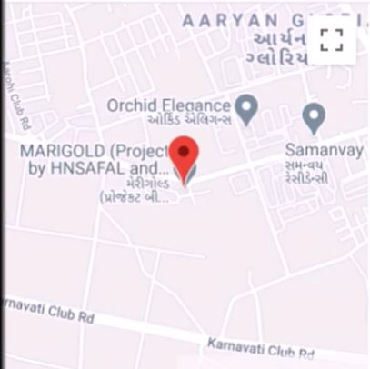
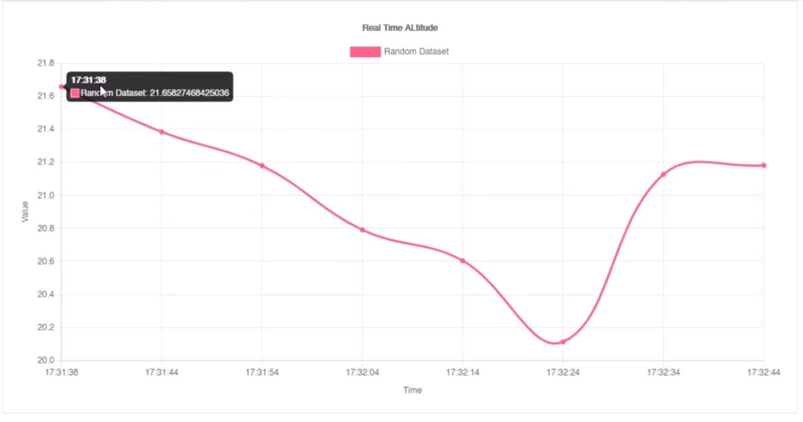
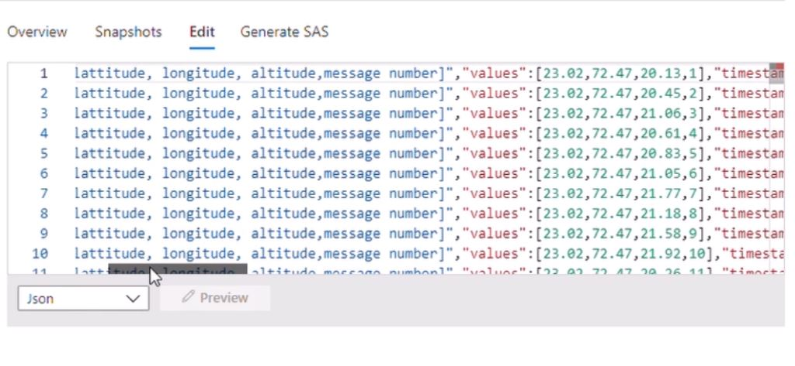

# drone-network-iot-nodemcu-azure
This is the end semester project done for the IOT (Internet of Things) course at BITS Pilani, Pilani Campus. In this project, we develop an end to end drone management and networking system using Node MCU, Ublox-NEO6M GPS Sensor, Flask, PythonAnywhere and Azure.

## 1. Prerequisites
 * To replicate the results, you need to first download and install the necessary libraries in your Arduino Library Manager. 
 * Once that is done you need to have an account in Microsoft Azure and PythonAnywhere. In Azure create an IOT Hub and add a device 'NodeMCU'. Remember to always keep your API keys as you will require them in your code.
 * Now replace your Wifi SSID and Password into the POST.ino and GET.ino codes. Also replace your API keys in the correct places. 
 * On your account at PythonAnywhere, upload the map.txt and index.txt files. These will be used to generate the look of the map and the graph.

## 2. Execution
 * First interface your NodeMCU with your GPS Sensor and store your lattitude, longitude and altitude values decoded from the NMEA sentences. 
 * Create a JSON payload using POST.ino and send it to your created hosting page on PythonAnywhere.
 * If successful you should be able to see the received string at {home page}/getjson
 * Furthermore, you will also be able to see the position on the map and altitude data on the graph at the following pages - {home page}/map and {home_page}/graph

It should look like this - 
 

 

The graph can be seen as follows - 

 

* Finally, you can receive this data from the PythonAnywhere page by running GET.ino which will print out the payload in the serial monitor. It will then connect to your Azure IOT Hub and will send the data to the blob storage you have created. 

Your output in Azure will look like the following - 

 

